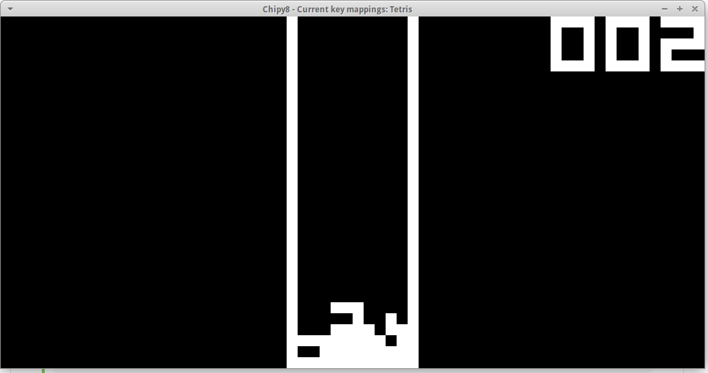

# Chipy8
A CHIP-8 emulator written in Rust using SDL2


#requrements
[rust-sdl](https://github.com/AngryLawyer/rust-sdl2) for your platform.
#Compile
````
cargo build --release
````
#Run
````
./target/chipy8 ROMFILE
````
Or with cargo
````
cargo run --release -- ROMFILE
````
#Key Mappings
3 Different key mappings are provided (Default, Alt and Tetris). Selected with F1, F2 and F3 keys. All mappings map to WASD+Space keys. Period key '.' resets the emulator. Esc exits.
#Example
To compile and run with the included Tetris
````
cargo run --release -- ./roms/TETRIS
````
Or (on Windows)
```
cargo build --release
target\release\chipy8.exe roms\TETRIS
```
Then change to the Tetris key mapping with F1 key.
